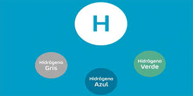

# 2.1. ¿Qué es el hidrógeno verde 💚 y en qué se diferencia del gris 🖤 y azul 💙?

  

  

## **Hidrógeno verde 💚**
  
El hidrógeno verde es una fuente de energía clave en la estrategia de España 🇪🇸 para alcanzar la neutralidad climática 🌍 y descarbonizar la economía 🔋. Su producción no genera emisiones de carbono ❌🌫️, ya que se obtiene mediante electricidad renovable ⚡ y agua 💧 a través del proceso de *electrólisis* ⚙️ (descomposición del agua en oxígeno y hidrógeno).

Asimismo, el hidrógeno obtenido mediante el reformado del biogás 🌾 o la biomasa 🍃 también pueden considerarse renovables, siempre que se cumplan los criterios de sostenibilidad ✅.
Actualmente se utiliza en la industria química 🏭, refinerías de petróleo ⛽, transporte 🚆, energía ⚡ y calefacción 🔥.

---
## **Hidrógeno gris 🖤**

 El hidrógeno gris es el más contaminante 🌫️, ya que se produce a partir de combustibles fósiles 🛢️, principalmente gas natural. Su proceso de producción, llamado reformado con vapor de metano (Steam Methane Reforming, SMR), libera grandes cantidades de CO₂ 🌍💨 a la atmósfera. 

--- 
## **Hidrógeno azul 💙**

  Es un tipo de hidrógeno producido a partir de gas natural 🔥 mediante un proceso llamado reformado con vapor (Steam Methane Reforming) u oxidación parcial (POX, Partial Oxidation). A diferencia del gris, el CO₂ generado es capturado y almacenado 🏭📦 mediante tecnologías de Captura y Almacenamiento de Carbono (CCS, Carbon Capture and Storage), reduciendo su impacto ambiental.

---
## Comparativa

| 🔹 Tipo de Hidrógeno | 🌱 Impacto Ambiental | 💰 Costo | 🔥 Fuente de Energía
|---|---|---|---|
| 💚 Verde | ✅ Cero emisiones 🌍 | 🔺 Más caro 💵 | ⚡ Renovable (agua + electrólisis) 💧⚙️ |
| 💙 Azul | ⚠️ Menos emisiones que el gris  | 🔹 Intermedio | 🔥 Gas natural + Captura de CO₂ 🏭 |
| 🖤 Gris | ❌ Alto impacto ambiental 🌫️🌍 | 🔻 Más barato 💰 | 🛢️ Gas natural (sin captura de CO₂) |

  
El hidrógeno verde es el más sostenible 🌍♻️ pero aún costoso 💰. El azul es una opción intermedia 🔵, con menor impacto ambiental pero dependiente del gas natural. El gris sigue siendo el más económico ⚫, pero altamente contaminante 🌫️.
