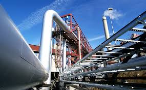

# Infraestructura necesaria: Plantas de electrólisis, almacenamiento y transporte

  

   

## 1. Plantas de Electrólisis

Las plantas de electrólisis son fundamentales para la producción, conservación y distribución eficiente de hidrógeno verde 🌱🔋.
Este proceso utiliza energía eléctrica proveniente de fuentes renovables ⚡ para dividir el agua en oxígeno e hidrógeno.
A diferencia de los métodos tradicionales de producción de hidrógeno que utilizan combustibles fósiles y generan emisiones de CO₂ 🌍💨, la electrólisis con energía renovable no produce emisiones.
Infraestructura necesaria:

**Electrolizadores: 🔌**

Son los dispositivos clave que realizan el proceso de electrólisis. Estos dispositivos pueden ser de diferentes tipos, como:
✨Electrolizadores alcalinos
✨Electrolizadores de membrana de intercambio protónico: Más eficientes y rápidos.
✨Electrolizadores de óxido sólido: Mayor eficiencia a largo plazo.
✨Conexión a fuentes de energía renovable: Las plantas deben estar conectadas a parques solares 🌞, eólicos 🌬️ u otras fuentes de energía limpia.
✨Infraestructura eléctrica: Es necesaria para conectar las plantas de electrólisis a las redes eléctricas de energía renovable ⚡, y también para gestionar las fluctuaciones de electricidad.

**Desafíos:**
Costos de inversión: La infraestructura de electrólisis es costosa 💰, pero los costos están disminuyendo a medida que la tecnología avanza 🚀.
Escalabilidad: La producción a gran escala de hidrógeno verde requiere un aumento considerable en la capacidad de electrólisis ⚙️.

---
## 2. Almacenamiento de Hidrógeno Verde

El hidrógeno producido necesita ser almacenado de manera eficiente, ya que no se consume inmediatamente en muchos casos.
Existen varias opciones de almacenamiento dependiendo de la forma y la cantidad de hidrógeno:

✨Almacenamiento a alta presión: El hidrógeno se comprime a presiones muy altas. Esta es una de las opciones más utilizadas para el transporte y almacenamiento 🚚🔋.
✨Almacenamiento en forma líquida: Enfriando el hidrógeno a temperaturas extremadamente bajas, se puede convertir en un líquido ❄️. Esto aumenta la densidad energética, pero es costoso y requiere sistemas criogénicos de alta tecnología 🧊.
✨Almacenamiento en materiales sólidos: Investigaciones están desarrollando materiales como hidruros metálicos o carbono poroso para almacenar hidrógeno de manera más densa y segura 🧪.
✨Almacenamiento subterráneo: Similar al almacenamiento de gas natural 🌍, se utilizan grandes cavidades para albergar importantes cantidades de hidrógeno durante largos períodos.

**Desafíos:**
Costo y eficiencia energética: El almacenamiento a alta presión y en forma líquida requiere una gran cantidad de energía ⚡.
Durabilidad y seguridad: Es necesario garantizar que los sistemas de almacenamiento sean seguros para evitar fugas o accidentes 🚨 y que puedan ser utilizados a largo plazo.

  

   

## 3. Transporte de Hidrógeno Verde

El transporte de hidrógeno es esencial para que el gas llegue a los mercados donde se va a utilizar,
ya que la producción de hidrógeno verde no siempre ocurre cerca de los puntos de consumo:

✨Tuberías: El hidrógeno se puede transportar a través de tuberías 🚇, de manera similar a como se transportan el gas natural o el petróleo. Este es uno de los métodos más eficientes, pero requiere una infraestructura de tuberías dedicada.
✨Transporte por carretera y ferrocarril: El hidrógeno comprimido se transporta en camiones cisterna 🚛 o trenes 🚂, aunque este método es más costoso y menos eficiente que las tuberías.
✨Transporte marítimo: En caso de exportación o distribución a gran escala, el hidrógeno puede ser transportado en buques 🚢 en forma líquida, lo que requiere grandes inversiones en infraestructura portuaria y barcos especiales.

*Ejemplo: España 🇪🇸 está trabajando en la creación de una Red Troncal Española de Hidrógeno, que incluirá varios tramos como Guitiriz-Zamora, Huelva-Algeciras, y conexiones en la Meseta Norte y Sur.*

**Desafíos:**
Costos de transporte: El hidrógeno es menos denso en energía que el gas natural ⛽, lo que hace que el transporte sea más caro 💸.
Infraestructura de tuberías y vehículos adecuados: El transporte requiere una red de infraestructura específica 🛠️, como tuberías reforzadas, camiones especializados 🚛 y puertos adecuados para el manejo de hidrógeno ⚓.
